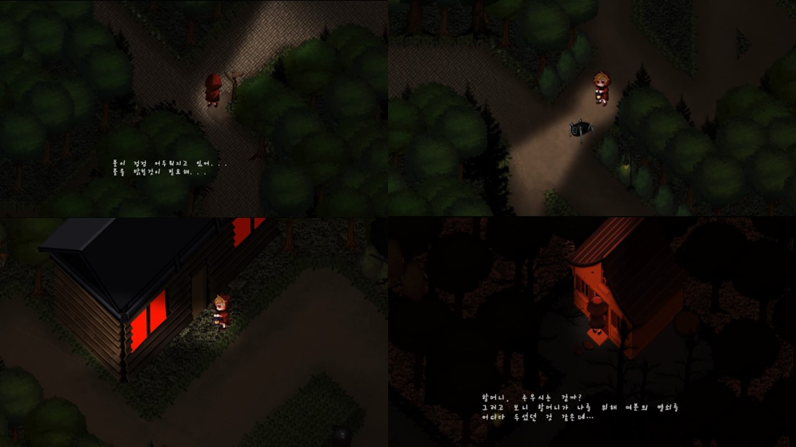
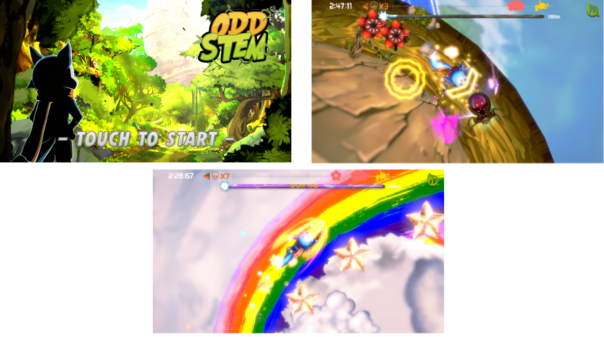
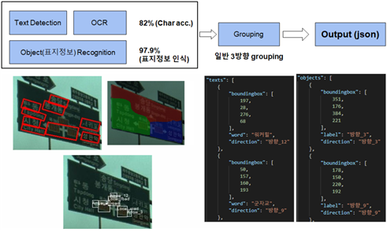
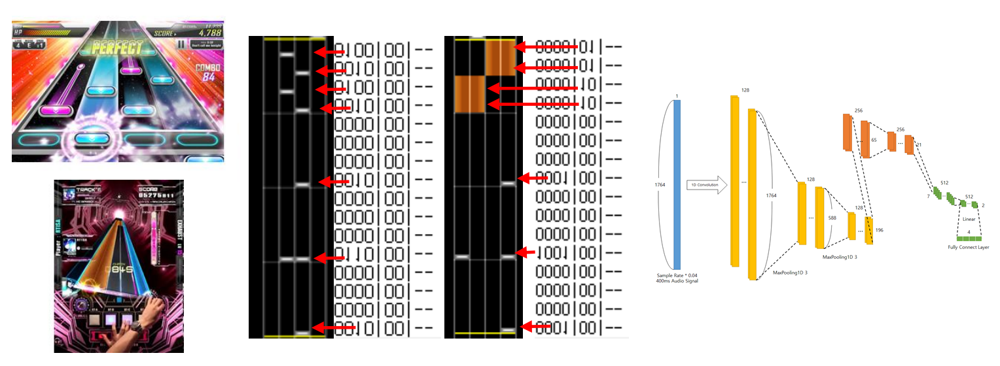

# Garnet's Profile

### 프로필
이름 - 권민섭 
생년월일 - 1996/01/06 
이메일 - kmu9842@naver.com 

### 교육
2015.03 ~ 2018.02 서강대학교 게임교육원 
2018.03 ~ 2020.02 서강대학교 영상대학원 
게임프로그래밍전문가 자격증(한국콘텐츠진흥원) 

### 경험
인디게임 위크앤드 1회, 2회, 해커톤 다수 참가 
[미래창조과학부 소프트웨어 마에스트로 4기](https://swm.recruiter.co.kr/appsite/company/index) 
C++ Korea 운영진 2기 
NDC 2016 2017 2018 2019 
수원공업고등학교 기능경기대회반 강사(C, C++, GameFramework) 
GStar 국제게임쇼 서강대학교 게임교육원 부스에 게임전시 - ODD STEM 
서강대학교 게임교육원 게임소프트웨어 개발과 졸업 
서강대학교 영상대학원 Mdeia Lab 석사과정 연구원 - 지도교수 정문열 교수님 
서강대학교 영상대학원 VDS Lab 석사과정 연구원 - 지도교수 서용덕 교수님 
영상처리 및 이해에 관한 워크샵 - IPIU2019, IPIU2020 
[AI 그랜드 챌린지 Track 2 “문자인식” 8위(27팀 참가)](https://www.ai-challenge.kr/) 
2019 RL Study Group 
2020 C++ Design pattern Study Group 
현대 Mnsoft 산학 연구 - SD Map 도로속성 생성을 위한 딥러닝 알고리즘 개발 
~~다수의 컴공 친구들 과제 도와줌~~ 

### 언어&Tech 
C++, C#, Python, Pytorch, DeepLearning, DirectX, Java, WinAPI, Reinforcement Learning...
### Tool
visual studio Code, Anaconda, docker, Unity3D, Unreal...

### 논문
[딥 러닝을 이용한 도로 표지 이미지의 정보 획득 및 분석](http://dcollection.sogang.ac.kr:8089/dcollection/srch/srchDetail/000000065074?navigationSize=10&query=%2B%28%28all%3A%EA%B6%8C%EB%AF%BC%EC%84%AD%29%29&pageSize=10&insCode=211029&searchWhere1=all&searchTotalCount=0&sortDir=desc&pageNum=1&rows=10&searthTotalPage=0&treePageNum=1&sortField=score&start=0&ajax=false&searchText=%5B%EC%A0%84%EC%B2%B4%3A%EA%B6%8C%EB%AF%BC%EC%84%AD%5D&searchKeyWord1=%EA%B6%8C%EB%AF%BC%EC%84%AD) - 석사 학위 논문 
1D CNN을 이용한 리듬게임의 Note Placement 연구 - IPIU2020 제출 논문 
Warping rectangle shaped traffic sign plate image by detecting edge - IPIU2020 제출 논문, 제 2저자 

### 포트폴리오

[포트폴리오 다운로드(논문, 소스코드, 영상)](https://drive.google.com/open?id=1vr2uj68nfmNupvZsdPojutsHZRpwOVyI) 

<strong>Junk2D</strong> DirectX 기반의 2D 게임 프레임워크 
C++과 DirectX를 이용하여 전반적인 Game Framework를 설계하고 제작한 프로젝트 
github에는 타 학생들이 응용하기 쉽도록 주석과 최소한의 예제를 포함한 기본적인 형태로 업로드하였음   

<strong>ODD STEM</strong> Unity3D를 이용한 모바일게임 
그래픽 디자이너, 기획자들과 팀으로 unity3D를 이용하여 제작한 모바일게임 
쉐이더를 제외한 프로그래밍 작업을 전부 진행하였음  
GSTAR 2017 서강대학교 게임교육원 부스 전시 
플레이 영상 - https://www.youtube.com/watch?v=_cP8xAIMlCY   

Classification of Animation Charactor <strong>딥러닝을 이용한 애니메이션 캐릭터 분류</strong> 
Pytorch와 딥러닝의 Code에 대한 기본적인 이해를 목적으로 pytorch-cifar를 참조하여 
ShuffleNetV2 신경망을 이용해 제작한 프로젝트   

<strong>딥 러닝을 이용한 도로 표지 이미지의 정보 획득 및 분석</strong> 
문자, 객체, Grouping의 학습용 데이터의 양식 지정과 전처리, 
사용할 딥러닝 모델의 선택과 응용, 재학습과 학습한 결과의 후처리를 담당하였음  
딥 러닝을 이용한 도로 표지 이미지의 정보 획득 및 분석 - 석사 학위 논문 
현대 Mnsoft 산학 연구 - SD Map 도로속성 생성을 위한 딥러닝 알고리즘 개발   

<strong>volTexNet</strong> 
딥러닝을 이용한 리듬게임의 채보 제작 연구 
산학연구과제 종료 후 진행된 1인 프로젝트로 학습을 위해 librosa를 
이용하여 .ksh파일로 된 Sound Voltex 리듬게임의 채보 데이터의 전처리와 
모델의 설계, 설계한 모델을 pytorch로 코딩하여 학습 후 결과의 후처리를 하였음  
1D CNN을 이용한 리듬게임의 Note Placement 연구 - IPIU2020    

### Hobby
[인형 촬영](https://www.instagram.com/ggarnet__/), 게임 
MDD 시라사카 코우메 2019.02.19 ~ 
카메라 캐논 450D -> 캐논 EOS M3 -> Nikon 810D  

